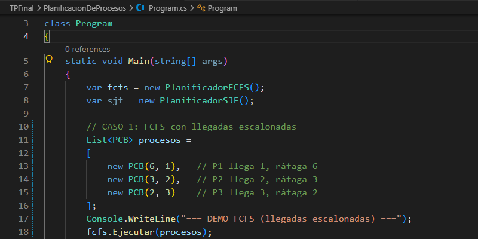
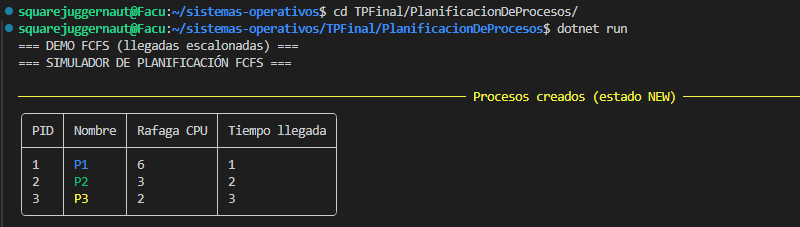
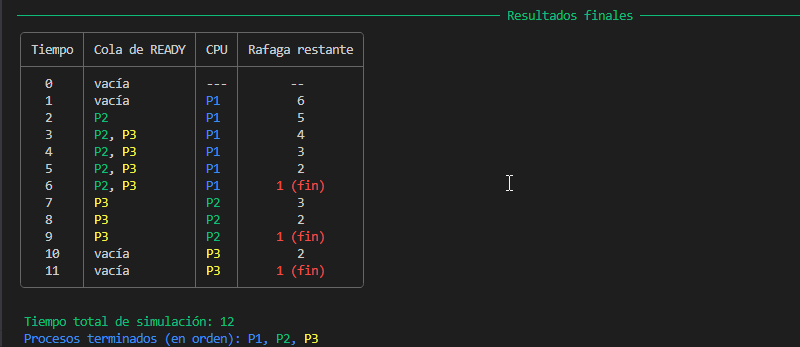

# Simulador de Planificación de Procesos

## Descripción

Simulador de algoritmos de planificación de procesos para la materia **Sistemas Operativos** (UNAHUR). Implementa los algoritmos **FCFS** y **SJF (no apropiativo)** con visualización paso a paso en consola, utilizando tablas profesionales con colores.

---

## Tecnologías utilizadas

- **Lenguaje:** C# (.NET 8)
- **UI:** [Spectre.Console](https://spectreconsole.net/) (tablas, colores, bordes)
- **Entorno:** WSL (Ubuntu)

---

## Cómo ejecutar

### Requisitos
- .NET SDK 8.0 o superior

### Pasos

```bash
# 1. Clonar el repositorio
git clone https://github.com/tuusuario/planificadores.git

# 1.1 O si se usa SSH colnar el repositorio
git clone git@github.com:tuusuario/planificadores.git

# 2. Entrar a la carpeta del proyecto
cd PlanificacionDeProcesos

# 3. Ejecutar
dotnet run
```

---


## Algoritmos implementados

| Algoritmo | Tipo | Estructura de datos |
|-----------|------|----------------------|
| **FCFS** | No apropiativo | `Queue<PCB>` (FIFO) |
| **SJF** | No apropiativo | `PriorityQueue<PCB, (int rafaga, int pid)>` |

## Características

- Simulación **paso a paso** (unidad por unidad de tiempo)
- Tablas profesionales con **colores** por proceso
- Límite de **10 procesos** como máximo (con mensaje de error)
- Cambio de estado: `NEW → READY → RUNNING → TERMINATED`
- 8 casos de prueba predefinidos (comentados en `Program.cs`)


## Estructura del proyecto
```markdown
PlanificacionDeProcesos/
├── .gitignore # Lo que no es necesario que persista en el repositorio
├── BitacoraPersonal.md # Información detallada del proceso de construcción del proyecto (decisiones, problemas encontrados)
├── Program.cs # Punto de entrada y casos de prueba
├── PlanificadorBase.cs # Lógica común a todos los planificadores
├── PlanificadorFCFS.cs # Implementación de FCFS
├── PlanificadorSJF.cs # Implementación de SJF
├── LayoutTabla.cs # UI (tablas, colores, formato)
├── PCB.cs # Clase PCB (proceso)
├── EstadoProceso.cs # Enum de estados
├── PlanificacionDeProcesos.csproj # Dependencias (Spectre.Console)
└── README.md
```
---

## Caso de prueba: FCFS con llegadas escalonadas

### Captura 1: Código fuente

La siguiente imagen muestra el archivo `Program.cs` con el **Caso 1 (FCFS con llegadas escalonadas)** descomentado.



> Se observa que el caso 1 está activo (sin comentar). (El resto de los casos deben estar comentados con `//`). Al ejecutar `dotnet run`, solo se ejecutará este caso.

---

### Captura 2: Procesos creados (estado NEW)

Al ejecutar el programa, se muestra la tabla de procesos en estado `NEW`.



> Se observan los tres procesos del Program.cs creados anteriormente con sus PID, nombres, ráfagas de CPU y tiempos de llegada. Todos comienzan en estado `NEW` antes de ser admitidos por el planificador.

---

### Captura 3: Simulación FCFS paso a paso

La simulación avanza unidad por unidad de tiempo, mostrando la cola de READY, el proceso en CPU y su ráfaga restante.



> En el tiempo 1, P1 llega y pasa directamente a CPU (porque está libre). En el tiempo 2, P2 llega y se encola en READY. En el tiempo 3, P3 llega y también se encola. P1 continúa ejecutándose hasta el tiempo 6, donde su ráfaga restante llega a 1 y se muestra `"1 (fin)"` en rojo, indicando que en esa unidad de tiempo finaliza. Luego, P2 y P3 se ejecutan en orden de llegada (FIFO).

--- 

### Resultado esperado

El orden de ejecución para FCFS con estos datos es:

> **P1 (llega en 1) → P2 (llega en 2) → P3 (llega en 3)**

El resumen final de la simulación muestra que el tiempo total fue **11** y el orden de finalización fue **P1 → P2 → P3**, que es el esperado para FCFS. Esto valida el correcto funcionamiento del planificador.

---

## Autor

**Facundo Leonel Paz**  
Licenciatura en Informática - UNAHUR  
Materia: Sistemas Operativos - 1C 2026  
Profesor: Ing. Gabriel Esquivel